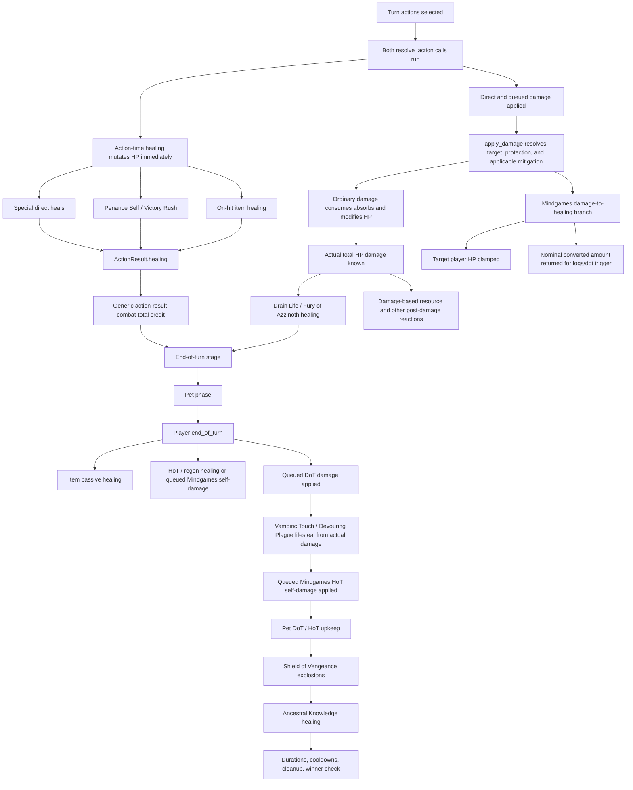

# Mak'Gora Healing Architecture Review

Review baseline: `53ba30f` on 2026-07-11.

This is a planning and architecture review only. No engine behavior is changed by this document.

## Executive conclusion

Mak'Gora should **not** gain a resource-equivalent, all-purpose healing pipeline.

The current architecture is already sound at the mechanic level: healing formulas stay with abilities and effects, damage-derived healing waits for actual dealt HP damage, HoTs use the effect lifecycle, and Shield of Vengeance continues through the damage pipeline. Folding all of that into one healing service would mostly move control flow and add policy flags.

A much smaller abstraction is worthwhile: promote the existing clamp operation into one shared, player-only final-application helper in `effects.py`, tentatively:

```python
def apply_player_healing(target: PlayerState, amount: int) -> int:
    """Apply positive HP restoration up to hp_max and return actual HP gained."""
```

That helper should own only amount normalization, the upper HP cap, the HP write, and the actual-gained return value. It should not own Mindgames, healing eligibility, formulas, healing modifiers, HoT ticking, lifesteal calculation, shields, logs, combat totals, pet healing, or PvE targeting.

This is a modest recommendation, not a call for a new subsystem. Without complete adoption, caller use of the returned actual amount, tests, and a narrow guardrail, the helper would merely move repeated `min(...)` expressions.

## 1. Current healing architecture

### 1.1 Current flow



Important ordering properties:

- Both actions finish their action-time healing before either champion's direct damage is applied (`resolver.py:3592-3599`, then `resolver.py:3989-4028`). A refactor must not defer direct healing until after incoming damage.
- Damage-derived healing runs only after direct, queued-proc, strike-again, redirect, mitigation, absorb, and Mindgames resolution (`resolver.py:_resolve_actor_post_damage_reactions_stage`, invoked at `resolver.py:4230-4246`).
- In `effects.end_of_turn()`, DoT events are computed first, but item and effect healing mutates HP before the resolver applies those queued DoT events (`effects.py:2706-2727`, `resolver.py:1313-1350`).
- Mindgames-converted periodic healing is queued as self-damage and applied before Shield of Vengeance can explode later in the same end-of-turn stage.
- The winner check remains last. Player healing and lifesteal can currently restore a champion from negative HP before finalization; `scenario_healing_resolves_from_negative_hp_before_winner_check` intentionally protects this behavior.

### 1.2 Healing entry points and HP writes

| Source | Formula/trigger owner | Where HP is modified | Current accounting and conversion behavior |
| --- | --- | --- | --- |
| Healthstone | `resolver._handle_healthstone_special` (`resolver.py:994-1006`) | Inline `actor.res.hp` clamp | Explicit Mindgames check; normal branch returns/logs actual healing, converted branch logs requested self-damage |
| Holy Light | `resolver._handle_holy_light_special` (`resolver.py:1016-1029`) | Inline player clamp | Explicit Mindgames check; normal branch returns/logs actual, converted branch logs requested self-damage |
| Flash Heal | `resolver._handle_flash_heal_special` (`resolver.py:1032-1046`) | Inline player clamp | Clarity applied before healing; normal branch returns/logs actual, converted branch logs requested self-damage |
| Lay on Hands | `resolver._handle_lay_on_hands_special` (`resolver.py:1049-1061`) | Direct assignment to `hp_max` | Mindgames converts and logs the full requested missing-HP amount; normal branch uses a bespoke nonnumeric log |
| Wild Growth | `resolver._handle_wild_growth_special` (`resolver.py:1137-1154`) | Inline player clamp | Explicit Mindgames; normal `ActionResult` carries actual, while normal and converted logs use requested amounts |
| Penance (Self) | `resolver.resolve_action` (`resolver.py:2784-2800`) | Inline player clamp per hit | Per-hit Mindgames and Clarity; normal branch logs/returns actual gain, converted branch logs requested self-damage |
| Victory Rush / generic ability heal-on-hit | `resolver.resolve_action` (`resolver.py:3089-3118`) | `_apply_mindgames_aware_healing`, then `_apply_heal_with_clamp` | Triggered from a landed/reduced hit, not final dealt HP; result carries actual, log prints requested |
| Thunderfury heal-on-hit | `effects.trigger_on_hit_passives` (`effects.py:2231-2257`) | Inline player clamp | Returns actual `bonus_healing`; log prints requested; currently bypasses Mindgames |
| Fury of Azzinoth | `resolver._resolve_actor_post_damage_reactions_stage` (`resolver.py:423-430`) | Inline player clamp | Heals from total actual dealt HP damage, including landed secondary events; credits/logs actual |
| Drain Life | Same post-damage stage (`resolver.py:448-457`) | Inline player clamp | Heals from actual dealt HP damage; credits/logs actual |
| Vampiric Touch / Devouring Plague | `effects.tick_dots` metadata plus `resolver.resolve_end_of_turn_stage` (`resolver.py:1317-1337`) | Inline source-player clamp | Lifesteal percentage is applied to actual tick HP damage; credits/logs actual |
| Frenzied Regeneration | Handler snapshots rage into `regen.hp` (`resolver.py:1121-1134`) | Generic effect clamp in `effects.trigger_end_of_turn_effects` | HoT lifecycle remains effect-driven; Mindgames produces queued self-damage |
| Regrowth | Handler snapshots formula into `regen.hp` (`resolver.py:1157-1170`) | Same generic effect clamp | Dispels/duration stay in effect lifecycle; Mindgames produces queued self-damage |
| Healing Stream | Handler snapshots formula into `regen.hp` (`resolver.py:1173-1183`) | Same generic effect clamp | Same generic HoT path |
| Vanish and Ice Block regeneration | Effect metadata (`abilities.py:270-285`, `effects.py:145-161`) | Same generic effect clamp | Ice Block has a deliberate self-regen exception under `immune_all`; logs requested HP, totals use actual |
| Spirit Light Sword / Staff of Immortality | Item `heal_self` data (`items.py:24-29`, `items.py:38-43`) | `effects.trigger_end_of_turn_passives` (`effects.py:2608-2634`) | Totals use actual; logs requested; currently bypasses Mindgames |
| Ancestral Knowledge | `resolver.resolve_end_of_turn_stage` (`resolver.py:1404-1429`) | Inline player clamp | Requires a living shaman with absorb; credits/logs actual; currently has no Mindgames/Cyclone check at this site |
| Mindgames: outgoing damage becomes target healing | `resolver.apply_damage` closure (`resolver.py:3750-3763`) | `_apply_heal_with_clamp` | Runs after target resolution/protection/mitigation; returned `mindgames_healing` is nominal converted damage, not actual HP gained; no target-healing total is credited |
| Kill Command | `resolver._handle_kill_command_special` (`resolver.py:959-992`) | Inline `pet.hp` clamp | Pet-only healing; currently credited once in the handler and again by generic `ActionResult` aggregation |
| Emerald Serpent Lightning Breath | `pet_ai._run_pet_special` (`pet_ai.py:624-653`) | Inline pet clamp and inline owner-player clamp | Each requests `floor(actual dealt HP damage / 2)` and caps independently; owner gets combined actual credit; owner component bypasses Mindgames/Cyclone policy |
| Generic pet effect healing | `effects.end_of_turn_pet` (`effects.py:2730-2757`) | Inline `pet.hp` clamp | Returns actual `healing_done`, but the resolver does not consume it; no live pet HoT or test currently defines who should receive that credit |

The existing player clamp primitive is `resolver._apply_heal_with_clamp` (`resolver.py:203-208`). It is used only by `_apply_mindgames_aware_healing` and by the Mindgames damage-to-healing branch. Most player healing reimplements it inline.

### 1.3 Healing modifiers, reduction, and overheal

There is no general healing-modification layer in the repository.

What does exist:

- `modify_stat()` can indirectly change a healing formula's Attack or Intellect input.
- Clarity of Mind is an ability-specific 1.4 multiplier for Flash Heal and Penance. Its stack consumption and RNG behavior belong to those abilities, not to generic healing application.
- Damage modifiers and mitigation indirectly affect lifesteal because lifesteal uses final actual damage. They are not healing modifiers.
- Cyclone denies actions and causes `effects.end_of_turn()` to return early. It is an eligibility rule, not healing reduction.
- Mindgames converts one event type into another; it is not a percentage reduction.

What does not exist:

- no outgoing-healing multiplier;
- no incoming-healing multiplier;
- no Mortal Wounds/healing-reduction effect (Mortal Strike is damage-only in `abilities.py:91-100`);
- no dampening;
- no overheal statistic or combat-total field.

Overheal is currently only implicit: HP is capped, and most totals use the HP delta. Logs are inconsistent. Healthstone, Holy Light, Flash Heal, Penance, lifesteal, pet healing, and Ancestral Knowledge generally log actual gain. Wild Growth, Victory Rush, Thunderfury, item end-turn healing, effect regeneration, and Mindgames damage conversion report the requested or nominal value. No near-cap regression matrix defines these differences as intentional.

`DamageApplicationResult.mindgames_healing` needs special care. It currently carries the nominal converted damage, even when the target is full. That value is also used by `apply_direct_damage_dot()` as evidence that the source hit resolved under Mindgames. Replacing it with actual HP gain would break direct-DoT application at full HP. This field cannot be silently redefined during a healing-helper migration.

## 2. Strengths

1. **Damage-derived healing is correctly late.** Drain Life, Fury of Azzinoth, Vampiric Touch, and Devouring Plague use actual HP damage rather than speculative raw damage. Existing tests cover mitigation, absorbs, Dragonwrath duplicates, strike-again damage, and negative-HP recovery.

2. **HoT creation is data/effect driven.** Frenzied Regeneration, Regrowth, and Healing Stream store per-tick values in effect data, then use the common end-of-turn effect path. The resolver does not need a per-tick branch for each HoT.

3. **Mindgames self-damage preserves damage concerns explicitly.** Direct converted healing uses the dedicated resolver closure `apply_self_inflicted_magical_damage`; periodic converted healing becomes a queued `DAMAGE_SOURCE_SELF` event and goes through `apply_damage()`. Absorbs, immunity, Cloak, stealth breaking, Bear Form rage, and Shield of Vengeance accumulation therefore remain outside final HP restoration.

4. **Shield of Vengeance reuses the damage pipeline.** Its explosion is not implemented as healing. Mindgames can flip its resolved champion damage into healing only at the normal damage-conversion point.

5. **Most combat totals use actual HP delta.** The architecture already has the right value available at most sites, even though the ownership of total updates is inconsistent.

6. **Player recovery before winner finalization is explicit and tested.** This is a subtle duel-engine behavior that a generic nonnegative-resource helper would easily break.

7. **The code has not prematurely invented healing source kinds, heal packets, or a general entity system.** The current data-driven abilities/effects remain the right foundation for this duel-shaped engine.

## 3. Weaknesses and duplication

### 3.1 Duplication worth removing

The repeated useful kernel is only:

1. normalize a positive requested amount;
2. read player HP;
3. apply the upper `hp_max` cap;
4. write HP;
5. return actual HP gained.

That kernel is repeated across direct abilities, damage-derived healing, item passives, HoTs, Ancestral Knowledge, and the owner half of pet healing. It is worth centralizing because every caller needs the same actual delta for totals and, where intended, logs.

The repeated synchronous Mindgames check in ordinary direct self-heal handlers can also reuse the existing resolver-level `_apply_mindgames_aware_healing` orchestration wrapper. That wrapper is not the central HP helper: it decides whether to call the damage path first, then delegates ordinary HP application.

### 3.2 Duplication that should remain

The following similarities are superficial and should not be merged:

- direct-heal formulas, dice rolls, stat reads, and Clarity multiplication;
- Healthstone percentage healing and Lay on Hands missing-HP calculation;
- Victory Rush's on-hit trigger versus Drain Life's actual-damage trigger;
- HoT creation, same-turn ticking, duration decrement, dispels, and immunity exceptions;
- direct versus queued Mindgames conversion;
- Shield of Vengeance absorb accumulation and explosion timing;
- player and pet eligibility rules;
- pet targeting, resources, action order, and dual-recipient healing;
- source-specific log wording;
- combat-total attribution and ownership;
- cooldown, cost, denial, and effect-consumption logic.

Trying to centralize those concerns would require flags such as `allow_dead`, `respect_cyclone`, `convert_mindgames`, `queue_conversion`, `credit_owner`, `target_is_pet`, `log_requested`, and `source_kind`. That would be a second resolver, not a healing helper.

### 3.3 Concrete current inconsistencies

One live accounting defect is directly supported by the current control flow and a read-only deterministic probe:

1. **Kill Command healing is double-counted.** `_handle_kill_command_special()` credits the pet heal at `resolver.py:988-990`, returns the same value at `resolver.py:992`, and generic action-result aggregation credits it again at `resolver.py:3596-3599`.

Other divergences and latent contract gaps are real but not sufficiently specified to call them bugs without a mechanic decision:

- `effects.end_of_turn_pet()` returns `healing_done`, but `resolver.resolve_end_of_turn_stage()` does not consume it. No live pet HoT or test currently defines whether that healing should be credited to the owner.
- Thunderfury and end-turn item healing bypass Mindgames, while direct abilities and effect regen do not.
- DoT lifesteal into a cycloned source, Emerald Serpent owner healing, and Ancestral Knowledge can bypass the broad "cannot take healing" wording associated with Cyclone.
- Mindgames heal-to-damage logs use requested healing even when absorbs or immunity reduce actual self-damage.
- Mindgames damage-to-healing logs use nominal converted damage even when HP is capped.
- Mindgames damage-to-healing credits no healing total to the restored target; meanwhile, ordinary action-result aggregation has already credited the source's nominal damage. The intended attribution is not specified by tests.
- Some logs use requested healing and others actual healing.
- Healing totals are written through three patterns: generic `ActionResult` aggregation, direct post-damage/end-of-turn credit, and pet-AI credit. The Kill Command defect demonstrates the ownership risk.

Test coverage is strongest for damage-derived correctness and weakest for overheal, healing-total summaries, item healing, live HoT ticks, and cross-products involving Mindgames/Cyclone/pets. No test currently asserts the `FH`/`EH` post-combat summary values rendered through `sockets.py` and `duel.html`. Effect-tag validation covers Regrowth and Frenzied Regeneration but does not include live Healing Stream's `hot`/`end_of_turn` metadata in its expected subset.

## 4. Would centralization reduce bugs?

### A full pipeline would not

A full `grant_player_healing(...)` equivalent that owns modifiers, Mindgames, logs, totals, eligibility, and timing would mostly relocate code. It would also obscure the current resolution order and create a callback-heavy dependency from `effects.py` back into resolver-owned damage application.

It would be especially dangerous because:

- healing can become damage before any HP cap is considered;
- damage can become healing only after target resolution and mitigation;
- player HP may be negative temporarily, unlike resources;
- healing may target `PlayerState.res.hp` or `PetState.hp`;
- healer/credit owner and healed target can differ;
- some heals depend on final damage and cannot run earlier;
- action-time and end-of-turn healing intentionally happen at different stages.

### A small final-application helper would

A pure player-HP application helper would prevent new inline clamp variants, make the actual delta consistently available, and support a narrow static guardrail. It would reduce cap/accounting mistakes at the lowest layer without changing mechanic ownership.

The benefit is conditional. If callers ignore its returned actual amount, if only a few sites adopt it, or if no guardrail prevents new direct positive HP writes, the helper is only code movement.

## 5. Comparison with the resource pipeline

| Concern | `grant_player_resource()` | Healing |
| --- | --- | --- |
| Supported state | Player mp/energy/rage | Player HP, plus separate pet HP mechanics |
| Lower bound | Resources are always clamped nonnegative | Player HP can remain negative until the winner check |
| Universal modifiers | Challenger/resource-gain passives apply consistently | No general healing multiplier or reduction exists |
| Conversion | A resource gain stays a resource gain | Mindgames converts healing to damage and damage to healing |
| Trigger timing | The grant helper can run once a gain is known | Some healing cannot be known until final damage; HoTs are scheduled |
| Credit owner | The resource owner is the recipient | Pet/owner/source/target attribution varies |
| Logs | Callers should log returned actual gain | Current logs intentionally or accidentally mix requested and actual |

Healing should mirror only one useful API property of the resource helper: **return the actual amount applied after the cap**.

It should not be added as an `"hp"` case to `grant_player_resource()`. `tests/regression/test_resources.py:386-425` explicitly contracts that the resource helper ignores HP, and that boundary is correct.

## 6. Smallest useful abstraction

Recommended contract:

```python
def apply_player_healing(target: PlayerState, amount: int) -> int:
    """Apply positive HP restoration, cap only at hp_max, return actual gained."""
```

It should own:

- conversion of the input to a nonnegative integer;
- no-op behavior for a nonpositive amount or missing player resources;
- the upper `hp_max` cap;
- the `target.res.hp` mutation;
- a nonnegative actual-gained return value.

It must preserve the negative-HP rule: it must **not** first clamp current HP to zero. Healing a player at `-6` by `12` must leave HP at `6` and return an actual delta of `12`; healing by less than the deficit may leave HP negative until the final winner check.

The smallest useful return is an integer. A new `HealResult` packet, healing source-kind taxonomy, or overheal ledger is not justified by current consumers. A caller that genuinely needs overheal can derive `max(0, requested - actual)` from values it already owns.

The helper should be player-only. The three pet HP application sites use a different storage shape and different alive/owner/accounting rules. Keeping their local clamp explicit is less architecture than introducing an entity-polymorphic healing layer. If pet healing later becomes numerous, it can be reviewed from actual requirements rather than anticipated PvE.

`resolver._apply_mindgames_aware_healing()` may remain as a thin orchestration wrapper that checks Mindgames **before** calling the primitive. It must continue to convert the requested pre-clamp healing amount, not the amount that would have fit below `hp_max`.

## 7. What must remain outside the helper

### Mindgames

The helper must not inspect Mindgames. Healing-to-damage requires damage behavior: immunity, Cloak, Cyclone, absorbs, stealth breaking, Bear Form rage, and Shield of Vengeance absorb tracking. Direct conversion uses a dedicated resolver closure; periodic conversion additionally needs `DAMAGE_SOURCE_SELF` metadata and must be queued to preserve end-of-turn order. Damage-to-healing must stay inside `apply_damage()` after target resolution and mitigation.

### HoT ticking

Frenzied Regeneration, Regrowth, Healing Stream, Vanish, and Ice Block should keep scheduling and ticking through effect data and `effects.end_of_turn()`. Duration, cast-turn ticking, dispels, `immune_all`, and Mindgames queueing are lifecycle rules, not HP-application rules.

### Shield mechanics

Absorb creation/consumption, Shield of Vengeance's accumulated absorbed amount, explosion eligibility, AoE pet fanout, source kind, and explosion timing remain damage/shield concerns. Only a final Mindgames-flipped player HP write may call the primitive.

### Lifesteal and heal-from-damage

The helper must not calculate a percentage of damage. `_resolve_actor_post_damage_reactions_stage` and `resolve_end_of_turn_stage` must continue to wait for actual HP damage across redirects, absorbs, mitigation, duplicate spells, and strike-again events, then pass the already-computed healing amount to the primitive.

### Pet AI and pet healing

Kill Command's heal-before-special ordering, Emerald Serpent's damage prerequisite and dual recipients, pet resources, targeting, and owner attribution belong to the special handler or `pet_ai.py`. The owner-player component can use the player primitive; the pet component should remain explicit.

### Formulas and modifiers

Dice, Attack/Intellect scaling, maximum-HP percentages, missing-HP calculations, integer division across HoT ticks, Clarity of Mind, and stat snapshots stay with their current ability/effect owner. No speculative generic healing-modifier hooks should be added.

### Eligibility, logs, and totals

The helper must not decide whether Cyclone, immunity, death, or a specific source blocks healing. It must not format logs or update `combat_totals`. It does not know the healer, credited owner, source wording, or whether the caller will aggregate an `ActionResult` later. The existing Kill Command double count is exactly what happens when this ownership is split implicitly.

## 8. Future PvE impact

The helper would make future duel-shaped PvE slightly safer, not structurally easier.

A boss represented as the main combatant could use the same player HP primitive. Attached adds and pets would still use explicit pet/add behavior. The hard PvE questions would remain target selection, owner attribution, AI timing, effect eligibility, and whether an add inherits owner passives; an HP clamp does not solve those questions.

Therefore PvE is not a reason to broaden the helper to a generic entity service, ECS, hierarchy, battlefield, or many-vs-many pipeline. The recommended primitive is worthwhile on current duplication alone.

## 9. Ranked implementation risks

| Rank | Mechanic most likely to regress | Why |
| --- | --- | --- |
| 1 | Mindgames with absorbs and Shield of Vengeance | Pre-clamp heal-to-damage, queued periodic self-damage, nominal converted-damage reporting, immunity, absorbs, and same-turn explosion ordering cross both pipelines |
| 2 | Damage-derived healing and lethal ordering | Drain Life/Fury/DoT lifesteal must use final actual damage; negative-HP recovery must remain possible before winner finalization |
| 3 | End-of-turn HoT lifecycle and ordering | Cast-turn ticks, heal-before-queued-DoT application, `immune_all` exceptions, Cyclone suppression, duration decrement, and Mindgames queueing are timing-sensitive |
| 4 | Combat totals, overheal, and logs | Kill Command already double-counts; generic pet HoT credit has no defined consumer; tests barely cover summary totals; requested-versus-actual wording is inconsistent |
| 5 | Pet versus player semantics | HP storage, alive gates, heal-before-AI order, dual-recipient Lightning Breath, owner credit, and Mindgames scope differ |
| 6 | Direct-handler behavior | Denial-before-side-effects, cooldown/reset timing, Clarity consumption, per-hit clamping, and deterministic RNG/log wording must stay byte-for-byte stable |

## 10. One implementation roadmap

This is the only recommended roadmap. PRs 1-4 deliberately preserve current gameplay policy during the helper migration; ambiguous Mindgames/Cyclone item and pet behavior should not be silently changed as architecture work. PR 5 is explicitly a separate, narrowly behavior-changing correction for the confirmed Kill Command accounting defect, followed by enforcement.

### PR 1 - Pin the healing application contract

- Add a short healing-application contract to `AGENTS.md`: upper cap, returned actual delta, no lower clamp of transient negative HP, and explicit exclusion of Mindgames/logs/totals/pets.
- Add focused characterization scenarios in the existing regression domains for near-cap actual gain, negative-HP recovery, action-time heal-before-damage ordering, HoT/end-of-turn ordering, and nominal pre-clamp Mindgames conversion.
- Keep `grant_player_resource("hp", ...)` invalid.
- Do not encode the currently undefined item/pet/Cyclone cross-products as endorsed behavior.

### PR 2 - Add the primitive and migrate action-time player healing

- Add `effects.apply_player_healing()` returning an integer actual delta.
- Migrate `_apply_mindgames_aware_healing` and the direct handlers to the shared helper, while temporarily leaving `_apply_heal_with_clamp` only for `apply_damage()`'s Mindgames branch.
- Migrate Healthstone, Holy Light, Flash Heal, Lay on Hands, Wild Growth, Penance (Self), and generic Victory Rush healing.
- Reuse the existing resolver Mindgames wrapper where semantics already match; preserve requested pre-clamp conversion, RNG order, cooldowns, denial order, logs, and `ActionResult` aggregation.

### PR 3 - Migrate damage-derived and damage-converted player healing

- Migrate Fury of Azzinoth, Drain Life, Vampiric Touch/Devouring Plague lifesteal, and the final player HP write in `apply_damage()`'s Mindgames branch.
- Remove `_apply_heal_with_clamp` after that final caller migrates.
- Keep calculation and trigger placement in their current post-damage stages.
- Preserve `DamageApplicationResult.mindgames_healing`'s current nominal converted-amount semantics because direct-DoT application depends on it; do not redefine the packet in this PR.
- Re-run the absorbed duplicate, strike-again, post-mitigation, direct-DoT-under-Mindgames, and negative-HP winner-order scenarios.

### PR 4 - Migrate end-of-turn, passive, and owner-player healing

- Migrate Thunderfury, end-turn item healing, generic player effect regen/HoTs, Ancestral Knowledge, and only the owner-player half of Emerald Serpent healing.
- Keep item/effect trigger order, queued Mindgames damage, current per-site Mindgames/Cyclone behavior, visible logs, totals ownership, and pet HP writes unchanged.
- Add near-cap tests that separately assert actual HP delta and the currently preserved log convention, so a later log-correctness change is explicit rather than incidental.

### PR 5 - Correct confirmed accounting and add enforcement

- Add a targeted regression and correct the unambiguous Kill Command double credit.
- Leave `end_of_turn_pet().healing_done` attribution unchanged until a live pet-healing mechanic defines whether the owner receives credit.
- Add at least one assertion over the exposed friendly/enemy healing summary values.
- Add a narrow static guardrail for direct positive writes to `PlayerState.res.hp` in gameplay code. Allowlist damage, HP sacrifice, initialization/test setup, and all explicit pet `pet.hp` paths; do not ban every assignment containing `hp`.
- Update `AGENTS.md` to require player healing application through the helper while keeping pet healing, Mindgames conversion, logs, and totals at their existing owners.

Each PR should run at minimum:

```bash
python tests/run_regression.py
python tests/run_architecture_guardrails.py
python tests/run_source_kind_validation.py
```

Run subschool validation as well if any Mindgames or healing damage metadata is touched.

## 11. Concrete files and functions an implementation would touch

### Production code

- `effects.py`
  - new `apply_player_healing`
  - `trigger_on_hit_passives`
  - `trigger_end_of_turn_passives`
  - `trigger_end_of_turn_effects`
- `resolver.py`
  - `_apply_heal_with_clamp`
  - `_apply_mindgames_aware_healing`
  - `_resolve_actor_post_damage_reactions_stage`
  - `_handle_healthstone_special`
  - `_handle_holy_light_special`
  - `_handle_flash_heal_special`
  - `_handle_lay_on_hands_special`
  - `_handle_wild_growth_special`
  - `_handle_kill_command_special` for accounting only
  - `resolve_end_of_turn_stage`
  - the Penance (Self) and generic heal-on-hit blocks inside `resolve_action`
  - the Mindgames branch inside the `apply_damage` closure
- `pet_ai.py`
  - `_run_pet_special` owner-player Lightning Breath application only; pet AI and pet HP application remain local
- `AGENTS.md`
  - narrow healing-application contract and guardrail rule

### Tests

- `tests/regression/test_classes_abilities.py`
- `tests/regression/test_damage_pipeline.py`
- `tests/regression/test_dots_hots.py`
- `tests/regression/test_pets.py`
- `tests/regression/test_items_challenger.py`
- `tests/regression/test_ui_docs_metadata.py` for exposed total values if that is the smallest existing home
- `tests/regression/registry.py`
- `tests/source_kind_validation_suite.py` where queued Mindgames self-damage shape is exercised
- `tests/architecture_guardrail_suite.py`

`tests/regression/test_resources.py` should be rerun to preserve its existing HP-exclusion assertion for `grant_player_resource`; it does not need editing unless that contract test is relocated.

No ability, effect, item, or pet balance data needs to change for the helper itself.

## 12. Anti-goals and things not to change

- Do not add HP support to `grant_player_resource()`.
- Do not build a universal healing pipeline, event bus, healing source-kind taxonomy, or `HealResult` packet without a concrete consumer.
- Do not add generic healing multipliers, healing reduction, Mortal Wounds, dampening, or overheal statistics.
- Do not move Mindgames conversion out of the damage/resolver orchestration paths.
- Do not change `DamageApplicationResult.mindgames_healing` semantics as part of the helper migration.
- Do not change HoT application, same-turn tick behavior, effect durations, expiry, dispels, or end-of-turn order.
- Do not change actual-damage-based lifesteal placement or use speculative damage.
- Do not change Shield of Vengeance absorb tracking, explosion timing, AoE behavior, source kind, or outgoing-modifier exception.
- Do not make the helper decide Cyclone, immunity, dead-target, or resurrection eligibility.
- Do not move log formatting or combat-total mutation into the helper.
- Do not make pets inherit player healing modifiers or Mindgames behavior implicitly.
- Do not generalize player and pet HP into an entity hierarchy.
- Do not change formulas, dice, balance values, RNG order, cooldowns, costs, or action denial.
- Do not change `abilities.py`, `items.py`, `pets.py`, or `duel.html` for a behavior-preserving helper migration.
- Do not rewrite `resolve_turn`, the battlefield model, or the duel-shaped PvE direction.

## 13. Final recommendation

Keep the current mechanic architecture. It is already good enough and, in the damage-derived and HoT areas, deliberately ordered.

Add only a small shared player HP application primitive, adopt it completely, return actual HP gained, and enforce that narrow invariant. Treat Mindgames, Shield of Vengeance, HoT scheduling, lifesteal, pet AI, logs, totals, and eligibility as caller-owned mechanics.

The helper is worthwhile because player clamp/actual-delta code is widespread, complete adoption is statically enforceable, and future callers would receive the correct capped delta by construction. The separate accounting findings are not solved by this helper. A broader healing pipeline is not worthwhile: it would hide rather than simplify the engine's real timing and ownership differences.
